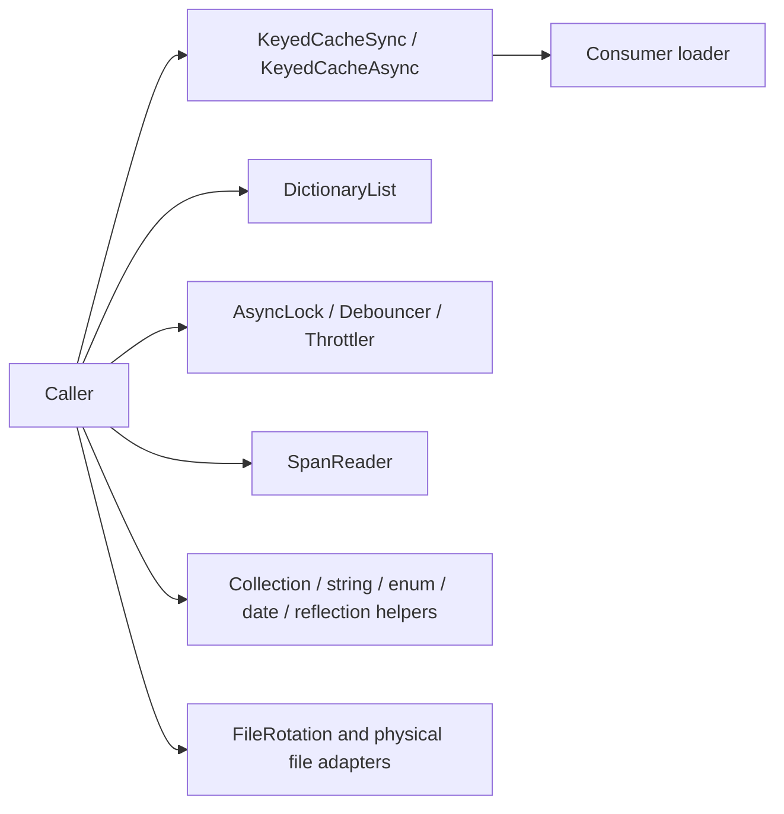
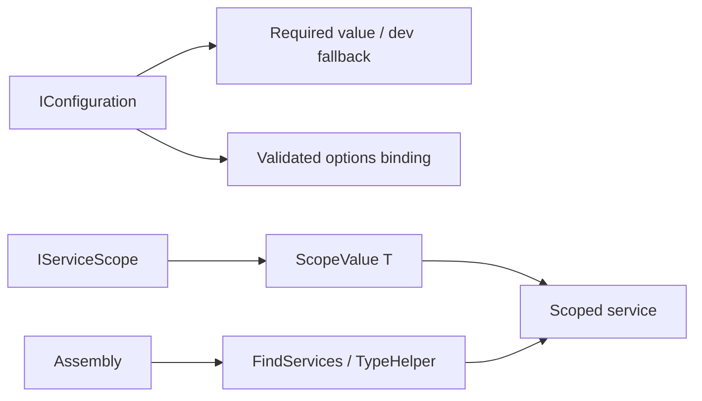
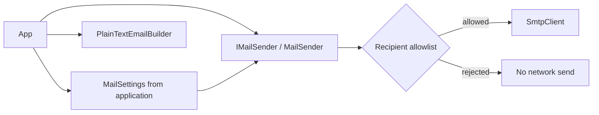

# Foundation architecture

This repository intentionally excludes application configuration files, API
credentials, bug-report models, payment/search/AI integrations, and any
Delphinium-specific behavior. Source implementations were adapted from
Delphinium Common (copyright Taylor White / Delphinium contributors); the
repository is distributed under the MIT license in `LICENSE`. Changes include
neutral namespaces, mail defaults, SMTP settings and validation, and recipient
filtering. No source is modified in Delphinium.

## Core

| Original Delphinium Common path | Foundation destination |
| --- | --- |
| `Common/Delphinium.Common.Shared/Utility/Caching/*.cs` | `src/dotnet/KiteKey.Core/Caching/*.cs` |
| `Common/Delphinium.Common.Shared/Collections/*.cs` | `src/dotnet/KiteKey.Core/Collections/*.cs` |
| `Common/Delphinium.Common.Shared/Utility/Concurrency/*.cs` | `src/dotnet/KiteKey.Core/Concurrency/*.cs` |
| `Common/Delphinium.Common.Shared/Utility/SpanReader.cs` | `src/dotnet/KiteKey.Core/Text/SpanReader.cs` |
| `Common/Delphinium.Common.Shared/Extensions/AsyncEnumerableExtensions.cs`, `CancellationTokenExtensions.cs`, `DateTimeExtensions.cs`, `DelegateExtensions.cs`, `EnumerableExtensions.cs`, `EnumExtensions.cs`, `ExceptionExtensions.cs`, `ExpressionExtensions.cs`, `ListExtensions.cs`, `LongExtensions.cs`, `RegexExtensions.cs`, `SemaphoreSlimExtensions.cs`, `SetExtensions.cs`, `StringExtensions.cs`, `TextReaderExtensions.cs`, `TypeExtensions.cs` | `src/dotnet/KiteKey.Core/Extensions/` (same filenames) |
| `Common/Delphinium.Common.Shared/Attributes/{Hidden,MapsTo,Searchable,Sortable,Transferable,Validated}Attribute.cs` | `src/dotnet/KiteKey.Core/Attributes/` (same filenames) |
| `Common/Delphinium.Common.Shared/Models/Base/{SimpleValueBase,StringValueBase}.cs`, `Models/Calendars/CalendarUnit.cs` | `src/dotnet/KiteKey.Core/Models/` (same relative paths) |
| `Common/Delphinium.Common.Shared/Utility/Files/**/*.cs` | `src/dotnet/KiteKey.Core/Utility/Files/` (same relative paths) |
| `Common/Delphinium.Common.Shared/Utility/{DebugHelper,DisposableStream,SlugHelper,StringHelper}.cs` | `src/dotnet/KiteKey.Core/Utility/` (same filenames; stream/slug rewritten to remove unsafe or domain-specific behavior) |

Core's async enumerable operations intentionally omit duplicates of the .NET 10
`System.Linq.AsyncEnumerable` API. `FileRotation` sorts by parsed timestamp
instead of filename, and the physical directory adapter rejects traversal.
`DisposableStream` consistently releases owned resources for sync and async
disposal.

## Hosting

| Original Delphinium Common path | Foundation destination |
| --- | --- |
| `Common/Delphinium.Common.Shared/Extensions/ConfigurationExtensions.cs` | `src/dotnet/KiteKey.Hosting/ConfigurationExtensions.cs` |
| `Common/Delphinium.Common.Shared/Extensions/ServiceCollectionExtensions.cs` (portable methods only) | `src/dotnet/KiteKey.Hosting/ServiceCollectionExtensions.cs` |
| `Common/Delphinium.Common.Shared/Services/ScopeValue.cs` | `src/dotnet/KiteKey.Hosting/ScopeValue.cs` |
| `Common/Delphinium.Common.Shared/Extensions/{AssemblyExtensions,ServiceScopeExtensions}.cs` | `src/dotnet/KiteKey.Hosting/` (same filenames) |
| `Common/Delphinium.Common.Shared/Utility/{TypeHelper,ServiceSearch}.cs` | `src/dotnet/KiteKey.Hosting/` (same filenames) |
| `Common/Delphinium.Common.Shared/Configuration/IConfigurationSettings.cs` | `src/dotnet/KiteKey.Hosting/IConfigurationSettings.cs` |

## Mail

| Original Delphinium Common path | Foundation destination |
| --- | --- |
| `Common/Delphinium.Common.WebServices/Mail/IMailSender.cs` | `src/dotnet/KiteKey.Mail/IMailSender.cs` |
| `Common/Delphinium.Common.WebServices/Mail/MailSender.cs` | `src/dotnet/KiteKey.Mail/MailSender.cs` |
| `Common/Delphinium.Common.WebServices/Mail/MailSettings.cs` | `src/dotnet/KiteKey.Mail/MailSettings.cs` |
| `Common/Delphinium.Common.WebServices/Mail/PlainTextEmailBuilder.cs` | `src/dotnet/KiteKey.Mail/PlainTextEmailBuilder.cs` |

No EF package is created: the Common source does not contain a cohesive,
provider-independent EF feature that warrants its own package.

## Remaining Common.Shared candidates and migration blockers

| Source path(s) | Reason not moved |
| --- | --- |
| `Attributes/NoIncludeAttribute.cs` | EF navigation-loading convention; no provider-neutral EF feature to package. |
| `Attributes/ObfuscateAttribute.cs`, `Models/DataTransfer/ObfuscateStyle.cs`, `Utility/Obfuscater.cs` | Couple an authorization/data-transfer policy to ad-hoc randomization (including a hard-coded date origin); unsafe for sensitive-data masking. |
| `Configuration/{AlgoliaSettings,AzureAiSettings,BlogSettings,DelphiniumSettings,OpenAiSettings,StripeSettings,VoiceLiveSettings}.cs`, `Extensions/ConfigurationBuilderExtensions.cs`, `Services/HostEnvironment.cs` | App/vendor-specific settings, shared-secrets lookup, or Delphinium default. |
| `Models/Bugs/*.cs`, `Models/Calendars/TimeInterval.cs` | Application bug/metric definitions, including congressional-session interval. |
| `Services/Options/{IWritableOptions,WritableOptionsJson}.cs` | Reads and rewrites a mutable JSON settings file (potential secrets), with no atomic update or cross-process coordination; a separate reviewed persistence design would be needed. |
| `Services/Serialization/Newtonsoft/Converters/HumanReadableEnumConverter.cs` | Newtonsoft-specific integration; adding this to Core would impose an unnecessary third-party runtime dependency. |
| `Utility/SlugHelper.cs`'s `GovernmentIdToSlug` method | Domain-specific government identifier conversion; generic methods ported. |
| `Utility/DisposableStream.cs` legacy lifetime and `Utility/Files/FileRotation.cs` legacy ordering behavior | Replaced by corrected portable implementations, rather than copying those implementations verbatim. |
