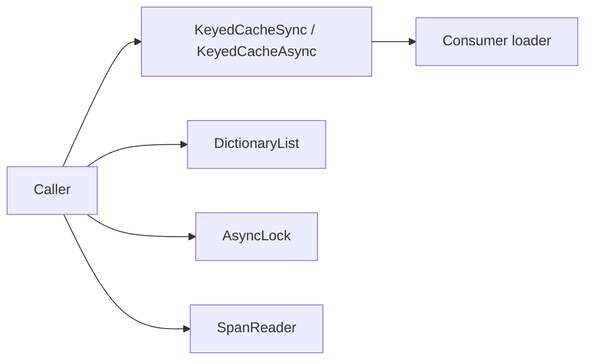
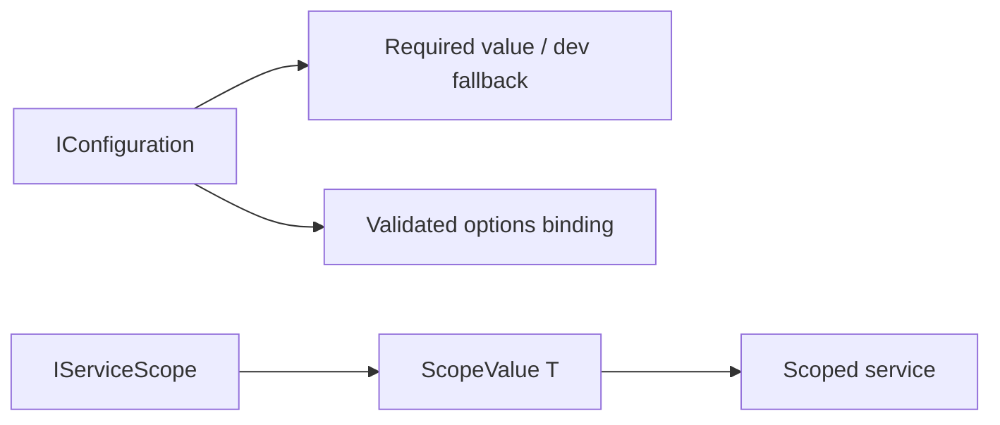
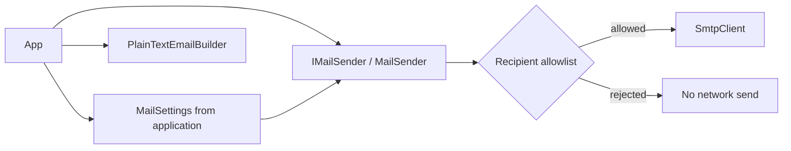

# Foundation architecture

This repository intentionally excludes application configuration files, API
credentials, bug-report models, payment/search/AI integrations, and any
Delphinium-specific behavior. Source implementations were adapted from
Delphinium Common (copyright Taylor White / Delphinium contributors); the
repository is distributed under the MIT license in `LICENSE`. Changes include
neutral namespaces, mail defaults, SMTP settings and validation, and recipient
filtering. No source is modified in Delphinium.

## Core

| Original Delphinium Common path | Foundation destination |
| --- | --- |
| `Common/Delphinium.Common.Shared/Utility/Caching/*.cs` | `src/dotnet/KiteKey.Core/Caching/*.cs` |
| `Common/Delphinium.Common.Shared/Collections/*.cs` | `src/dotnet/KiteKey.Core/Collections/*.cs` |
| `Common/Delphinium.Common.Shared/Utility/Concurrency/AsyncLock.cs` | `src/dotnet/KiteKey.Core/Concurrency/AsyncLock.cs` |
| `Common/Delphinium.Common.Shared/Utility/SpanReader.cs` | `src/dotnet/KiteKey.Core/Text/SpanReader.cs` |

## Hosting

| Original Delphinium Common path | Foundation destination |
| --- | --- |
| `Common/Delphinium.Common.Shared/Extensions/ConfigurationExtensions.cs` | `src/dotnet/KiteKey.Hosting/ConfigurationExtensions.cs` |
| `Common/Delphinium.Common.Shared/Extensions/ServiceCollectionExtensions.cs` (portable methods only) | `src/dotnet/KiteKey.Hosting/ServiceCollectionExtensions.cs` |
| `Common/Delphinium.Common.Shared/Services/ScopeValue.cs` | `src/dotnet/KiteKey.Hosting/ScopeValue.cs` |

## Mail

| Original Delphinium Common path | Foundation destination |
| --- | --- |
| `Common/Delphinium.Common.WebServices/Mail/IMailSender.cs` | `src/dotnet/KiteKey.Mail/IMailSender.cs` |
| `Common/Delphinium.Common.WebServices/Mail/MailSender.cs` | `src/dotnet/KiteKey.Mail/MailSender.cs` |
| `Common/Delphinium.Common.WebServices/Mail/MailSettings.cs` | `src/dotnet/KiteKey.Mail/MailSettings.cs` |
| `Common/Delphinium.Common.WebServices/Mail/PlainTextEmailBuilder.cs` | `src/dotnet/KiteKey.Mail/PlainTextEmailBuilder.cs` |

No EF package is created: the Common source does not contain a cohesive,
provider-independent EF feature that warrants its own package.
